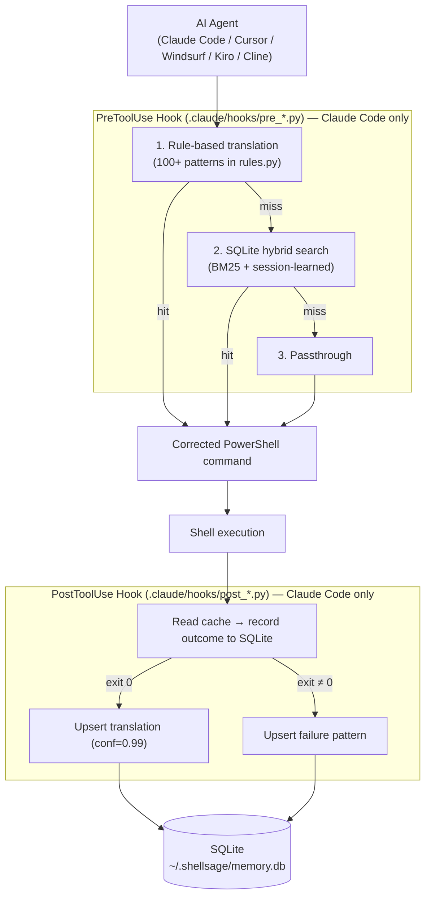

# Architecture

ShellSage is a two-tier translation pipeline backed by a local SQLite database, exposed via an MCP server.

---

## Request flow



---

## Storage

```
~/.shellsage/memory.db
├─ translations   (400+ seeds + session-learned pairs)
└─ failures       (error patterns for replay)
```

The database is always local, never synced, and zero-config. It grows as you use ShellSage.

---

## MCP server

```
MCP server (http://127.0.0.1:7842/sse)
├─ translate_command      → rules + SQLite lookup
├─ store_command_result   → write back to SQLite
├─ get_shell_context      → OS / shell / project detection
└─ get_stats              → health check
```

Agents that cannot use hooks (Cursor, Windsurf) call `translate_command` directly as a tool call. The result is the same — bash goes in, PowerShell comes out.

---

## Module map

| Module | Role |
|---|---|
| `config.py` | Env-var-backed settings — single source of truth |
| `models.py` | `ShellContext`, `Translation`, `CommandOutcome` — zero deps |
| `rules.py` | 100+ regex patterns (instant, no DB needed) |
| `seed.py` | 400+ curated bash→PS pairs; `init` loads a bounded set by default |
| `store.py` | SQLite: translations + failures, BM25-style lookup |
| `translator.py` | 2-tier resolution: rules → SQLite lookup → passthrough |
| `server.py` | FastMCP server (4 tools, stdio or HTTP/SSE) |
| `daemon.py` | Background process management (start / stop / status) |
| `setup_wizard.py` | Interactive installer with IDE auto-detection |
| `cli.py` | Click CLI (10 commands) |

---

## Design principles

**Local-first.** Every byte stays on your machine. The database is a single SQLite file. No network calls, no telemetry.

**Zero external services.** The rule engine works with no database at all. SQLite is part of the Python stdlib. The only optional dependency is the MCP server extras (`mcp`, `uvicorn`, `httpx`).

**Fail-open.** If ShellSage can't translate a command it returns the command unchanged. Agents always get _something_ to execute.

**Feedback loop.** The post-hook records every outcome. Commands that succeed at exit code 0 are stored with high confidence and surface earlier in future lookups.
