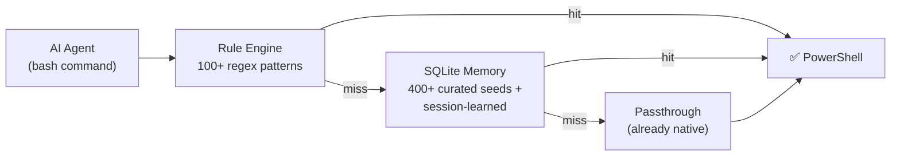

---
hide:
  - navigation
---

<div class="hero" markdown>

```
  ██████╗██╗  ██╗███████╗██╗     ██╗     ███████╗ █████╗  ██████╗ ███████╗
 ██╔════╝██║  ██║██╔════╝██║     ██║     ██╔════╝██╔══██╗██╔════╝ ██╔════╝
 ╚█████╗ ███████║█████╗  ██║     ██║     ███████╗███████║██║  ███╗█████╗
  ╚═══██╗██╔══██║██╔══╝  ██║     ██║     ╚════██║██╔══██║██║   ██║██╔══╝
 ██████╔╝██║  ██║███████╗███████╗███████╗███████║██║  ██║╚██████╔╝███████╗
 ╚═════╝ ╚═╝  ╚═╝╚══════╝╚══════╝╚══════╝╚══════╝╚═╝  ╚═╝ ╚═════╝ ╚══════╝
```

**The shell translation layer for AI coding agents**

[Get Started :material-arrow-right:](quickstart.md){ .md-button .md-button--primary }
[View on GitHub :fontawesome-brands-github:](https://github.com/inamdarmihir/shellsage){ .md-button }

</div>

---

## What is ShellSage?

ShellSage intercepts Bash-style tool calls made by your AI coding agent — Claude Code, Cursor, Windsurf, Kiro, Cline — and **silently rewrites bash syntax into correct PowerShell/CMD** before the shell sees it.

It works immediately with a local rule engine and a SQLite memory that learns from your sessions. **No API key. No cloud. No Docker. Runs entirely on your machine.**

---

## Why it matters

| Without ShellSage | With ShellSage |
|---|---|
| Agent writes `ls -la` → PowerShell fails → retry loop → 45k wasted tokens | Agent writes `ls -la` → silently becomes `Get-ChildItem -Force` → works ✓ |
| 3 bash failures per session ≈ 135k wasted tokens | 0 failures · 0 wasted tokens |
| Error traces pollute all future turns | Errors never reach the LLM context |

---

## How it translates



1. **Rule-based translation** — 100+ regex patterns covering common bash constructs. Instant, zero DB dependency.
2. **SQLite memory** — BM25-style lookup over 400+ curated seed translations plus anything learned from your own sessions. Stored locally in `~/.shellsage/memory.db`.
3. **Passthrough** — if no translation is needed (native PowerShell, git, docker), the command passes through unchanged.

---

## Quick install

```bash
pip install "shellsage[mcp]"
shellsage setup
```

The setup wizard detects your IDE, seeds the local database, and registers the MCP server in under a minute.

[Full quickstart →](quickstart.md){ .md-button }

---

## Features at a glance

<div class="grid cards" markdown>

-   :material-lightning-bolt: **Instant rule engine**

    ---
    100+ compiled regex patterns. No database needed — works offline from the first command.

-   :material-database: **SQLite memory**

    ---
    400+ curated bash→PowerShell pairs. Learns from your sessions automatically.

-   :material-server: **MCP server**

    ---
    Exposes 4 tools over SSE or stdio for direct agent calls.

-   :material-hook: **Claude Code hooks**

    ---
    Silent pre/post execution hooks rewrite commands before the shell sees them.

-   :material-shield-lock: **Local-first**

    ---
    Everything stored in `~/.shellsage/`. No cloud, no telemetry.

-   :material-chip: **Zero token waste**

    ---
    Failures never reach the LLM context, eliminating retry loops that burn tokens.

</div>
